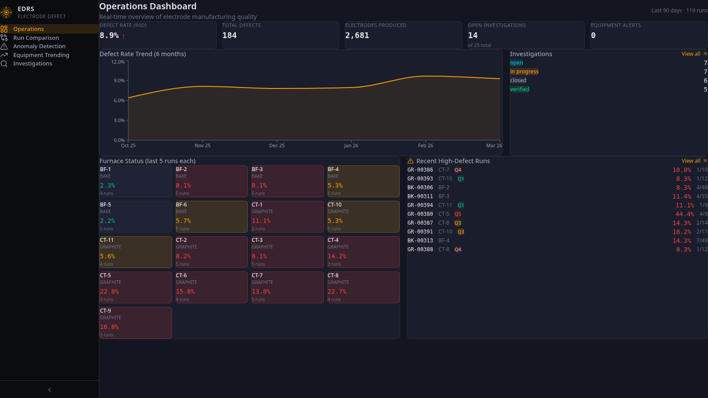
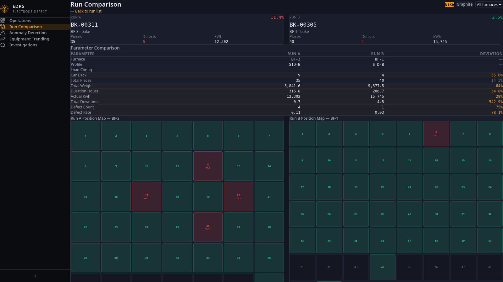
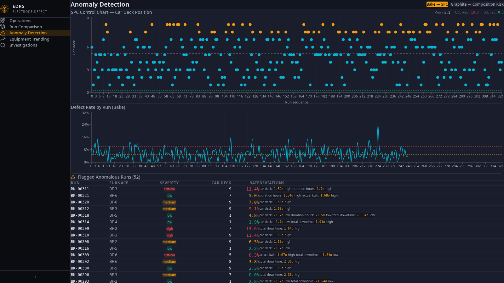
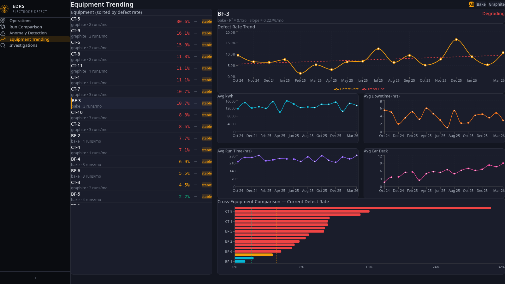
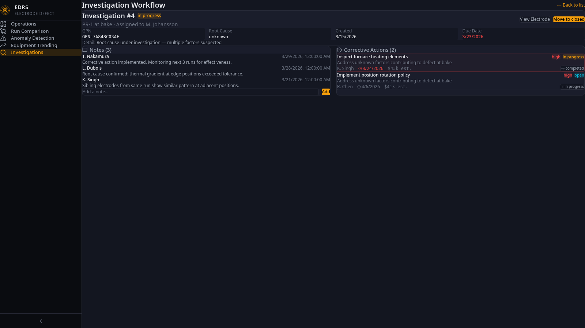
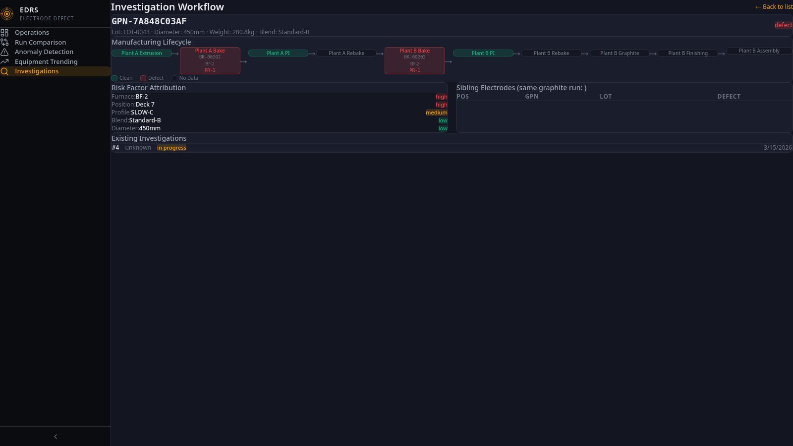

# EDRS — Electrode Defect Reduction System

A production-quality web application for graphite electrode manufacturers to reduce defective weight across multi-step manufacturing processes. Built for process engineers, department managers, reliability engineers, and maintenance managers who need to prevent defects, investigate problems, and track equipment health daily.



## Overview

Graphite electrodes are manufactured through a 10-step process across two plants. Defects can originate at one step but only be detected later — a crack introduced during baking may not show up until graphitization or finishing. This application provides the tools to trace, compare, detect, and investigate defects across the entire manufacturing lifecycle.

### Key Capabilities

- **Run Comparison** — Side-by-side comparison of furnace runs with process parameters, electrode position maps, and sensor data overlays
- **Anomaly Detection** — SPC control charts for bake operations, composition-based risk scoring (Q1-Q5) for graphite operations
- **Equipment Trending** — 18-month performance trending with degradation detection and cross-equipment comparison
- **Investigation Workflow** — Full electrode lifecycle tracing, root cause investigation, corrective action tracking

## Screenshots

### Run Comparison
Compare a high-defect run (BK-00311, BF-3, 11.4%) against a clean run (BK-00305, BF-1, 2.5%). Position maps show spatial patterns — defects cluster at specific furnace positions.



### Anomaly Detection
SPC control charts with UCL/LCL boundaries flag runs where car deck position or other parameters exceed statistical control limits.



### Equipment Trending
BF-3 showing degradation trend — defect rate increasing at 0.227%/month with supporting charts for kWh, downtime, run time, and car deck assignment.



### Investigation Detail
Investigation workflow with notes thread, corrective actions, status progression, and cost estimates.



### Electrode Lifecycle
10-step manufacturing lifecycle timeline showing where defects were introduced. Risk factor attribution and sibling analysis for spatial pattern detection.



## Tech Stack

- **Frontend:** React + TypeScript + Vite + Tailwind CSS + Recharts
- **Backend:** Python FastAPI
- **Database:** PostgreSQL (Lakebase-compatible for Databricks deployment)
- **Deployment:** Databricks Apps (port 8000)

## Data Model

| Table | Records | Description |
|-------|---------|-------------|
| `runs` | ~716 | Furnace runs across bake and graphite departments |
| `electrodes` | ~16,375 | Individual electrodes with full lifecycle tracking |
| `sensor_readings` | ~35,000 | Time-series sensor data (push displacement, resistance rate) |
| `lots` | ~200 | Lot-level quality summaries with risk tiers |
| `equipment_monthly` | ~306 | Pre-computed monthly equipment performance metrics |
| `risk_factors` | 26 | Validated categorical risk factors |
| `composition_risk` | 5 | Pre-load risk quintile definitions (Q1-Q5) |
| `investigations` | ~25 | Root cause investigations with status workflow |
| `investigation_notes` | ~75 | Timestamped investigation notes |
| `corrective_actions` | ~35 | Actions with priority, savings tracking, status |

## Local Development

### Prerequisites
- Python 3.10+
- Node.js 18+
- PostgreSQL 14+

### Setup

```bash
# Clone the repo
git clone https://github.com/jvangordon-cyber/electrode-defect-app-v2.git
cd electrode-defect-app-v2

# Create database
createdb electrode_v2

# Install backend dependencies
pip install fastapi uvicorn psycopg2-binary

# Seed the database
python -m backend.seed

# Start the backend
uvicorn backend.main:app --host 0.0.0.0 --port 8000

# In another terminal — install frontend dependencies
cd frontend
npm install

# Start the frontend dev server
npm run dev
```

The app will be available at `http://localhost:5173` with API proxy to port 8000.

### Databricks Apps Deployment

```yaml
# app.yaml
command: ["uvicorn", "backend.main:app", "--host", "0.0.0.0", "--port", "8000"]
```

Build the frontend (`npm run build` in `frontend/`) and the static files will be served from `static/`.

## Design Philosophy

- **Industrial professional** — dark theme with amber accents, inspired by furnace control room aesthetics
- **Domain-specific visualizations** — furnace position maps, SPC control charts, electrode lifecycle timelines
- **Data-dense** — engineers want to see the numbers; information is presented in dense tables and charts, not hidden behind interactions
- **Workflow-oriented** — every click leads to the next logical step in the defect investigation workflow

## Personas Served

| Persona | Primary Views |
|---------|--------------|
| Process Engineer | Run Comparison, Anomaly Detection, Investigations |
| Operator | Anomaly Detection (pre-load risk scoring) |
| Department Manager | Dashboard, Equipment Trending |
| Reliability Engineer | Equipment Trending |
| Maintenance Manager | Equipment Trending, Dashboard |
